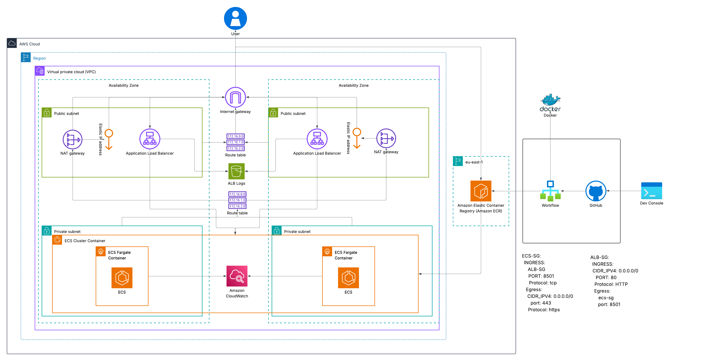

# Multi-AZ AWS ECS Fargate RAG Deployment

A production-style deployment of a containerized Medical RAG application on AWS ECS Fargate, built during the **Orange Hackathon**.

The infrastructure is provisioned with Terraform, the application is containerized with Docker, and GitHub Actions provides automated CI/CD using AWS IAM OIDC authentication.

---

## Architecture



The deployment consists of:

- **VPC** spanning two Availability Zones
- Public and private subnets
- Internet Gateway and NAT Gateway
- **Application Load Balancer (ALB)** in the public subnets
- **ECS Fargate** tasks running in private subnets
- **Amazon ECR Public** for container images
- **Amazon S3** for ALB access logs
- **Amazon CloudWatch** for ECS container logs and monitoring
- **GitHub Actions** for automated image builds and ECS deployments
- **AWS IAM OIDC** for keyless GitHub-to-AWS authentication

---

## Project Structure

```text
.
├── .github/
│   └── workflows/
│       └── auth-github-to-aws.yml
├── source/
├── src/
├── terraform/
│   ├── main.tf
│   ├── providers.tf
│   ├── variable.tf
│   ├── output.tf
│   ├── sg.tf
│   └── task_definition.json
├── Dockerfile
├── requirements.txt
├── constraints.txt
├── README.md
└── SETUP.md
```

---

## AWS Infrastructure

Terraform provisions the complete AWS environment.

### Networking

The project uses a custom VPC with CIDR:

```text
10.0.0.0/16
```

The VPC is distributed across two Availability Zones:

```text
              VPC
          10.0.0.0/16
               │
       ┌───────┴───────┐
       │               │
      AZ-a            AZ-b
       │               │
 ┌─────┴─────┐   ┌─────┴─────┐
 │  Public   │   │  Public   │
 │ 10.0.1/24 │   │ 10.0.2/24 │
 └───────────┘   └───────────┘
       │               │
 ┌─────┴─────┐   ┌─────┴─────┐
 │  Private  │   │  Private  │
 │ 10.0.3/24 │   │ 10.0.4/24 │
 └───────────┘   └───────────┘
```

The public subnets contain the Application Load Balancer and NAT Gateway.

The ECS tasks run in the private subnets without public IP addresses.

### Internet Access

The public route table routes internet traffic through the Internet Gateway.

Private subnet traffic destined for the internet is routed through the NAT Gateway located in a public subnet.

This allows ECS tasks to make outbound HTTPS requests without being directly exposed to the internet.

---

## Application Load Balancer

The Application Load Balancer is deployed across both public subnets.

Traffic flow:

```text
Internet
   │
   │ HTTP :80
   ▼
 ALB
   │
   │ HTTP :8501
   ▼
ECS Fargate Tasks
```

The ALB forwards traffic to the ECS target group using port `8501`, which is the port exposed by the Streamlit application.

ALB access logs are stored in an S3 bucket.

---

## ECS Fargate

The application runs as an ECS Fargate service with:

- Desired task count: **2**
- CPU: **1024**
- Memory: **2048 MiB**
- Network mode: `awsvpc`
- Private subnets
- No public IP addresses
- Container port: `8501`

Running two tasks across separate Availability Zones provides basic high availability.

CloudWatch Container Insights is enabled for the ECS cluster.

---

## Docker

The application is packaged using a lightweight Python image:

```dockerfile
FROM python:3.12-slim
```

Dependencies are installed using `requirements.txt` and `constraints.txt`.

The application listens on:

```text
0.0.0.0:8501
```

The container is started with:

```text
streamlit run src/app.py
```

---

## Amazon ECR Public

Docker images are pushed to Amazon ECR Public.

The deployment uses the `latest` image tag:

```text
public.ecr.aws/c0w4z1m9/medical-rag:latest
```

The ECS task definition references this image.

---

## CI/CD Pipeline

GitHub Actions automatically builds and deploys the application when changes are pushed to the `main` branch.

```text
Git Push
   │
   ▼
GitHub Actions
   │
   ├── Authenticate with AWS using OIDC
   │
   ├── Build Docker image
   │
   ├── Push image → ECR Public
   │
   ├── Update ECS task definition
   │
   └── Deploy updated task definition
             │
             ▼
        ECS Fargate
```

The complete build-to-deployment process takes approximately **5 minutes**.

### OIDC Authentication

The workflow does not use long-lived AWS access keys.

GitHub Actions obtains a short-lived identity token and assumes an AWS IAM role using:

```text
sts:AssumeRoleWithWebIdentity
```

The IAM trust policy restricts access to the specific GitHub repository and `main` branch.

This avoids storing permanent AWS credentials in GitHub secrets.

---

## CI/CD Workflow

The workflow performs the following steps:

1. Checks out the repository.
2. Authenticates with AWS using GitHub OIDC.
3. Logs in to Amazon ECR Public.
4. Builds the Docker image.
5. Pushes the image to ECR Public.
6. Reconfigures AWS credentials for the ECS region.
7. Updates the ECS task definition with the new image.
8. Deploys the updated task definition.
9. Waits for ECS service stability.

When a new image is deployed, ECS replaces the running tasks with tasks using the updated task definition/image.

---

## IAM

The project uses separate IAM roles for:

### ECS Task Execution Role

Used by ECS to:

- Pull container images
- Send container logs to CloudWatch
- Perform required ECS task execution operations

### GitHub Actions Role

Used by GitHub Actions to:

- Authenticate through OIDC
- Push images to ECR Public
- Register ECS task definitions
- Update ECS services
- Pass the ECS execution role

The GitHub Actions trust policy restricts the role to the intended repository and branch.

---

## Security Groups

The ALB security group allows inbound HTTP traffic:

```text
Internet → ALB :80
```

The ECS security group only allows inbound application traffic from the ALB security group:

```text
ALB → ECS :8501
```

ECS outbound HTTPS traffic is allowed for communication with AWS service APIs and other required external services.

This prevents direct internet access to the ECS tasks.

---

## Logging and Monitoring

### CloudWatch

ECS container logs are sent to:

```text
/ecs/medical-rag
```

The log group has a retention period of **7 days**.

### ALB Access Logs

ALB access logs are stored in an S3 bucket for later analysis and auditing.

---

## Troubleshooting

During development and deployment, several real infrastructure and CI/CD issues were encountered and resolved.

### GitHub OIDC Trust Policy

The GitHub Actions role initially failed authentication because the trust policy did not correctly match the GitHub repository/ref claims.

The repository and branch conditions were corrected so that only the intended `main` branch could assume the role.

### IAM Permissions

Deployment failures were investigated by checking the permissions required for:

- ECR Public authentication
- ECR image pushes
- ECS task definition registration
- ECS service updates
- IAM role passing

The GitHub Actions IAM policy was adjusted accordingly.

### ECR Public Authentication

ECR Public authentication uses the `us-east-1` control-plane region even though the ECS infrastructure is deployed in `eu-north-1`.

The workflow therefore authenticates against ECR Public in `us-east-1` before switching AWS configuration back to `eu-north-1` for ECS operations.

### Docker Image Deployment

Image tagging and task-definition configuration were debugged to ensure that the newly pushed image was correctly referenced during ECS deployment.

### AWS Region Configuration

Different AWS services and operations required careful handling of regional configuration, particularly the distinction between the ECR Public control plane and the ECS deployment region.

### ECS Deployment

ECS task definition and service configuration were debugged to ensure:

- Correct container name
- Correct container port
- Correct target group configuration
- Correct task networking
- Correct security groups
- Successful service stabilization

---

## Deployment Performance

The infrastructure can be provisioned from scratch with Terraform in approximately:

```text
< 4 minutes
```

The GitHub Actions build-to-deployment pipeline takes approximately:

```text
5 minutes
```

---

## Technologies

- AWS ECS Fargate
- Amazon ECR Public
- Application Load Balancer
- Amazon VPC
- Amazon S3
- Amazon CloudWatch
- AWS IAM
- Terraform
- Docker
- GitHub Actions
- GitHub OIDC
- Python
- Streamlit

---

## Key Takeaways

This project demonstrates an end-to-end cloud deployment workflow:

```text
Infrastructure as Code
        ↓
Containerization
        ↓
Private ECS Deployment
        ↓
Load Balancing
        ↓
OIDC Authentication
        ↓
Automated CI/CD
        ↓
Monitoring & Logging
```

The main goal was to build a reproducible AWS deployment where infrastructure, application packaging, authentication, and deployment are all automated rather than manually configured.